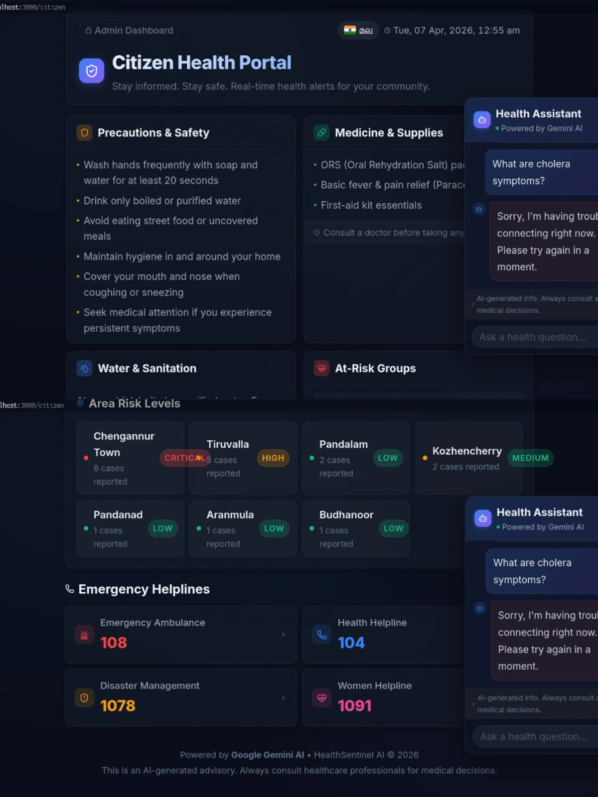
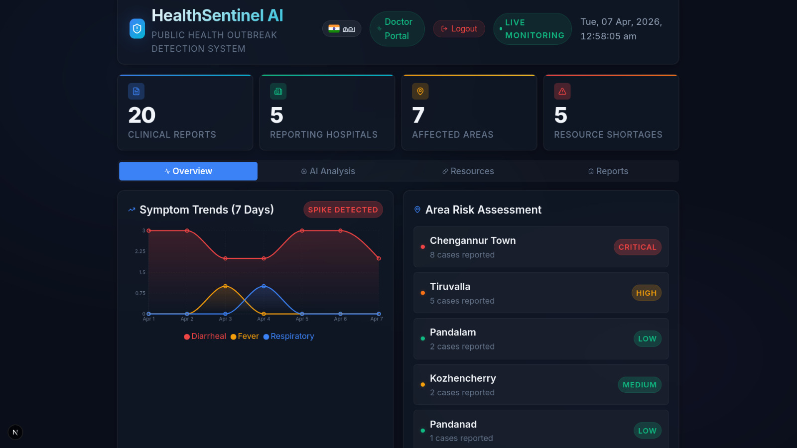

# HealthSentinel AI

## Problem Statement

Traditional public health surveillance systems are slow, fragmented, and reactive. Disease outbreaks are typically detected only after hospitals individually report data through bureaucratic chains — resulting in dangerous delays that allow outbreaks to spread unchecked. There is no unified, real-time system that aggregates clinical reports from multiple hospitals, identifies emerging patterns, and delivers immediate, actionable alerts to both health authorities and citizens.

HealthSentinel AI solves this problem by providing a unified, AI-powered real-time outbreak detection and public alerting platform.

---

## Project Description

HealthSentinel AI is a full-stack Next.js web application that aggregates anonymized clinical data from hospitals, uses Google Gemini AI to analyze disease patterns, and delivers real-time outbreak alerts and health guidance to both administrators and citizens.

### How It Works

1. **Doctors** submit anonymized patient symptom reports via the Doctor Portal. Reports are stored directly in Google Firebase Firestore.
2. The **Admin Dashboard** fetches all reports from Firestore and automatically triggers a **Google Gemini AI** analysis on page load.
3. Gemini AI acts as an expert epidemiologist — analyzing symptom clusters, geographic distribution, transmission patterns — and returns a structured JSON report including outbreak status, severity level, confidence score, affected areas, predicted trends, and actionable recommendations.
4. The **Citizen Portal** is a public-facing page that auto-fetches the latest AI analysis on load and displays a real-time health alert banner, precautions, area risk levels, and emergency helplines.
5. Citizens can also chat with the **AI Health Assistant** — a floating chatbot powered by Gemini AI — to ask general health questions in English or Malayalam.

### Key Features

- **AI Outbreak Detection** — Gemini AI analyzes aggregated anonymous clinical reports to detect disease clusters
- **Multi-Hospital Data Aggregation** — Reports from multiple hospitals collected into a single Firestore database
- **Real-time Symptom Trend Charts** — Interactive Recharts visualization showing day-over-day symptom patterns
- **Area Risk Assessment** — Geo-tagged reports mapped to named areas with color-coded risk levels (Low / Medium / High / Critical)
- **AI Confidence Scoring** — Gemini returns confidence percentage and severity level (Low / Medium / High / Critical)
- **Predicted Case Trend** — AI predicts whether the outbreak is Increasing, Stable, or Decreasing
- **Actionable Recommendations** — Distinct AI-generated guidance for health authorities and for citizens
- **Medicine Resource Monitoring** — Track hospital medicine stock levels and flag shortages
- **Rare Medicine Inventory (Doctor-only)** — Doctors can log and monitor rare medicine stocks via Firestore
- **AI Chatbot (Citizen Portal)** — Gemini-powered floating chatbot for public health Q&A
- **Bilingual Support** — Full English and Malayalam (മലയാളം) language support across all pages
- **Role-Based Access** — Public Citizen Portal vs. admin-protected Dashboard (session-based auth)
- **Responsive Design** — Optimized for desktop and mobile

---

## Google AI Usage

### Tools / Models Used

| Google Product                                                           | How It Is Used                                                       |
| ------------------------------------------------------------------------ | -------------------------------------------------------------------- |
| **Google Gemini 2.5 Flash** (`gemini-2.5-flash`)                 | Epidemiological outbreak analysis via `/api/analyze`               |
| **Google Gemini 2.5 Flash** (`gemini-2.5-flash`)                 | AI Health Chatbot responses via `/api/chat`                        |
| **Google Gemini SDK** (`@google/generative-ai`)                  | Official Node.js SDK used in both API routes                         |
| **Google Firebase Firestore**                                      | Primary database for clinical reports, resources, and rare medicines |
| **Google Firebase SDK** (`firebase/app`, `firebase/firestore`) | Database reads, writes, and queries                                  |
| **Google AI Studio**                                               | Source for the Gemini API key (`aistudio.google.com`)              |

### How Google AI Was Used

#### 1. Outbreak Detection (`/api/analyze`)

When the Dashboard or Citizen Portal loads, it sends all recent clinical reports (last 14 days) to the `/api/analyze` Next.js API route. This route:

- Initializes the **Gemini AI client** using `@google/generative-ai`
- Loads the `gemini-2.5-flash` model
- Constructs a detailed epidemiologist system prompt with all anonymized report data
- Instructs Gemini to return a **strict JSON response** with:
  - `outbreak_detected` (true/false)
  - `disease_name`, `confidence_percent`, `severity_level`
  - `total_suspected_cases`, `affected_areas`, `highest_risk_area`
  - `transmission_mode`, `incubation_period`, `at_risk_groups`
  - `predicted_trend`, `estimated_new_cases_next_week`
  - `recommended_actions` (for health authorities)
  - `citizen_precautions`, `medicine_requirements`
  - `water_sanitation_advisory`, `summary`

#### 2. AI Health Chatbot (`/api/chat`)

The Citizen Portal includes a floating chatbot widget (`ChatBot.js`) that:

- Sends user messages to the `/api/chat` Next.js route
- Initializes a **Gemini chat session** with full conversation history for context
- Applies a healthcare-constrained system prompt (no diagnoses, always recommends consulting a doctor, emergency numbers, bilingual support)
- Supports **multi-turn conversations** using `model.startChat()` with history
- Supports **Malayalam language** — when user switches to Malayalam, messages are prefixed to trigger Malayalam responses from Gemini
- Gracefully handles API quota errors with informative fallback messages

#### 3. Google Firebase Firestore

Firebase Firestore is used as the primary real-time database:

- **`clinical_reports` collection** — Stores anonymized patient reports submitted by doctors (hospital, area, lat/lng, age, gender, symptoms, date)
- **`resources` collection** — Stores hospital medicine and resource stock levels
- **`rare_medicines` collection** — Doctor-managed inventory of rare medicines

Firebase SDK operations used:

- `initializeApp`, `getApps` — Safe singleton initialization
- `getFirestore` — Database instance
- `collection`, `getDocs`, `addDoc`, `orderBy`, `query` — Full CRUD operations

### Proof of Google AI Usage

*(Screenshots to be attached here — save files in the `/proof` folder)*

---

## Application Architecture

```
Routes:
  /            →  Redirects to /citizen (public home)
  /citizen     →  Citizen Health Portal (public)
  /login       →  Admin Login Page (admin/admin)
  /dashboard   →  Admin Dashboard (protected, session auth)
  /doctor      →  Doctor Portal (protected, linked from dashboard)

API Routes:
  POST /api/analyze  →  Gemini AI outbreak analysis
  POST /api/chat     →  Gemini AI chatbot

Data Flow:
  Doctor submits report → Firebase Firestore
  Dashboard/Citizen page loads → Fetch Firestore reports → Send to Gemini → Display analysis
  Citizen asks chatbot → /api/chat → Gemini → Response
```

---

## Tech Stack

| Technology                          | Purpose                                          |
| ----------------------------------- | ------------------------------------------------ |
| **Next.js 16**                | Full-stack React framework (App Router)          |
| **Google Gemini 2.5 Flash**   | AI outbreak analysis and chatbot                 |
| **@google/generative-ai**     | Official Google AI SDK                           |
| **Google Firebase Firestore** | Real-time NoSQL database                         |
| **Firebase SDK v12**          | Database read/write operations                   |
| **Recharts**                  | Interactive symptom trend charts                 |
| **Lucide React**              | Icon library                                     |
| **Vanilla CSS**               | Styling (globals.css, dark theme, glassmorphism) |

---

## Pages & Features

### `/citizen` — Citizen Health Portal (Public)

- Auto-fetches Gemini AI outbreak analysis on load
- Live alert banner with severity level and disease name
- AI-powered stats: suspected cases, confidence %, predicted new cases, incubation period
- Prevention & precautions grid (AI-generated)
- Area risk zones with color-coded risk levels
- Health authority recommendations from Gemini
- Emergency helplines (108, 104, 1078, 1091)
- Floating AI chatbot (Gemini-powered)
- Bilingual: English / Malayalam

### `/dashboard` — Admin Dashboard (Protected)

- Session-based auth guard (redirects to `/login` if not authenticated)
- Real-time Firebase data indicator (Firebase vs. Mock Data badge)
- Stats: total reports, reporting hospitals, affected areas, resource shortages
- Tabs: Overview / AI Analysis / Resources / Reports
- Symptom trend chart (Recharts)
- Area risk assessment summary
- One-click Gemini AI outbreak analysis
- AI results: confidence bar, severity indicator, recommendations grid
- Medicine & resource availability table
- Anonymized clinical reports table
- Bilingual: English / Malayalam

### `/doctor` — Doctor Portal

- Submit anonymized patient reports to Firebase Firestore
- Hospital-to-Area mapping (auto-fills area + GPS coordinates)
- Multi-step form with progress indicator
- Rare Medicine Inventory tab — add and view rare medicines from Firestore
- All data feeds directly into the Gemini AI analysis pipeline

### `/login` — Admin Login

- Simple session-based authentication
- Credentials: `admin` / `admin`
- Sets `sessionStorage` flag and redirects to `/dashboard`

## Screenshots

Add project screenshots:




./images/citizen1.jpeg


./images/dispensery.jpeg


./images/docpanel.jpeg

---

## Demo Video

<video src="https://github.com/24525Bilal/repo/assets/UUID" width="500" controls></video>

---

---

## Installation Steps

1. **Install dependencies**

   ```bash
   npm install
   ```
2. **Configure environment variables**
   Copy `.env.example` to `.env.local` and fill in your credentials:

   ```bash
   cp .env.example .env.local
   ```
   Required variables:

   ```
   NEXT_PUBLIC_GEMINI_API_KEY=      # From aistudio.google.com
   NEXT_PUBLIC_FIREBASE_API_KEY=
   NEXT_PUBLIC_FIREBASE_AUTH_DOMAIN=
   NEXT_PUBLIC_FIREBASE_PROJECT_ID=
   NEXT_PUBLIC_FIREBASE_STORAGE_BUCKET=
   NEXT_PUBLIC_FIREBASE_MESSAGING_SENDER_ID=
   NEXT_PUBLIC_FIREBASE_APP_ID=
   ```
3. **Seed Firestore with sample data (optional)**

   ```bash
   node scripts/seed-firestore.mjs
   ```
4. **Run locally**

   ```bash
   npm run dev
   ```
   Open [http://localhost:3000](http://localhost:3000)

   - Public portal: [http://localhost:3000/citizen](http://localhost:3000/citizen)
   - Admin login: [http://localhost:3000/login](http://localhost:3000/login) → `admin` / `admin`
   - Dashboard: [http://localhost:3000/dashboard](http://localhost:3000/dashboard)
   - Doctor portal: [http://localhost:3000/doctor](http://localhost:3000/doctor)
# build-with-ai-chn-void

